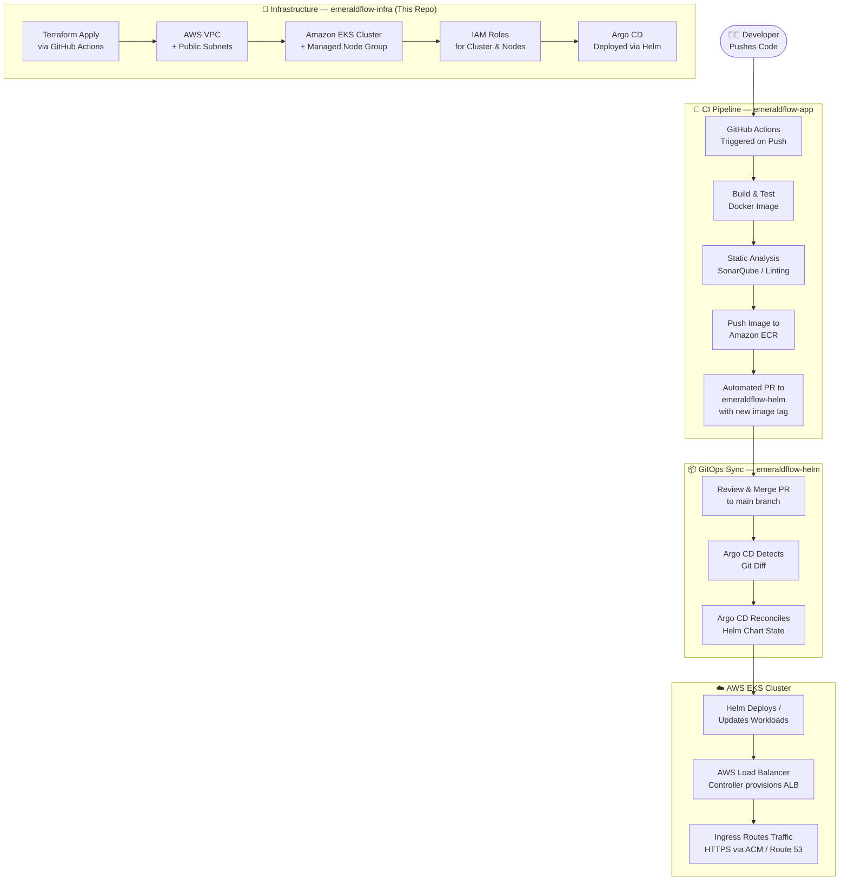

# EmeraldFlow — Infrastructure Repository


> **Foundational infrastructure layer of the EmeraldFlow GitOps portfolio project.**
> This repository provisions a production-grade, end-to-end GitOps architecture on AWS EKS using Terraform as the sole Infrastructure-as-Code tool. It is the entry point and architectural hub for a 3-tier decoupled system spanning infrastructure provisioning, Kubernetes application packaging, and continuous application delivery.

---

## Table of Contents

- [Executive Summary](#-executive-summary)
- [Architecture Overview](#-architecture-overview)
- [Repository Structure (3-Tier GitOps Model)](#-repository-structure-3-tier-gitops-model)
- [Infrastructure Components](#-infrastructure-components)
- [Input Variables](#-input-variables)
- [Outputs](#-outputs)
- [Quickstart — How to Replicate](#-quickstart--how-to-replicate)
- [GitHub Actions Pipeline](#-github-actions-pipeline)
- [Cleanup & Teardown Protocol](#️-cleanup--teardown-protocol)

---

## Executive Summary

EmeraldFlow implements a fully automated, **production-grade GitOps delivery pipeline** on AWS. The architecture enforces a strict separation of concerns across three decoupled repositories: infrastructure provisioning, application packaging, and application source code.

The infrastructure layer (this repository) provisions all foundational AWS primitives — VPC, EKS cluster, IAM roles, Managed Node Groups — using Terraform, with state stored remotely in Amazon S3. Application delivery is handled declaratively through Argo CD running inside the cluster, ensuring every deployment is auditable, versioned, and self-healing.

This design pattern mirrors real-world enterprise GitOps adoption and demonstrates proficiency across the full DevOps toolchain: **Terraform → GitHub Actions → Amazon ECR → Helm → Argo CD → EKS**.

---

## Architecture Overview

### End-to-End Delivery Lifecycle



---

## Repository Structure (3-Tier GitOps Model)

This project enforces a strict **separation of concerns** across three repositories, each with a single, well-defined responsibility.

| Repository | Role | Responsibility |
|:---|:---|:---|
| **`emeraldflow-infra`** *(this repo)* | 🔧 **Foundation Layer** | Provisions all AWS infrastructure: VPC, EKS cluster, Managed Node Groups, IAM roles, and Security Groups using Terraform. Remote state managed via S3. |
| **`emeraldflow-helm`** | 📦 **GitOps Source of Truth** | Contains Helm charts for all application workloads and Argo CD `Application` manifests. This is the only repository Argo CD watches to drive cluster state. |
| **`emeraldflow-app`** | 🚀 **Application & CI Layer** | Contains microservice source code, Dockerfiles, and GitHub Actions CI workflows. On every merge, the pipeline builds an image, pushes it to ECR, and opens a PR against `emeraldflow-helm` with the updated tag. |

### This Repository's File Structure

```
emeraldflow-infra/
├── .github/
│   └── workflows/
│       └── terraform.yml       # GitHub Actions: Validate, Plan, Apply pipeline
├── .agents/
│   └── rules/
│       └── emeraldflow.md      # Project-level AI assistant rules
├── argocd-ingress.yaml         # Argo CD ALB Ingress manifest (post-cluster setup)
├── backend.tf                  # Terraform S3 remote state configuration
├── iam_policy.json             # IAM policy document for AWS Load Balancer Controller
├── main.tf                     # Core resource definitions: VPC, EKS, Node Group, IAM
├── outputs.tf                  # Exported values: cluster name, endpoint, ARN
├── variables.tf                # All configurable input variables with defaults
├── .terraform.lock.hcl         # Provider version lock file
└── .gitignore                  # Excludes .terraform/, *.tfstate, *.tfvars
```

---

## Infrastructure Components

All resources are defined in [`main.tf`](./main.tf) and parameterized through [`variables.tf`](./variables.tf).

### Networking — VPC & Subnets

- **Custom VPC** (`10.0.0.0/16`) with DNS hostnames and resolution enabled.
- **2 Public Subnets** across separate Availability Zones (`us-east-1a`, `us-east-1b`), tagged for ELB discovery by the AWS Load Balancer Controller.
- **Internet Gateway** with a public route table association for all subnets.
- Cost-optimized design: no NAT Gateway — worker nodes use public subnets with direct internet access.

### Compute — Amazon EKS

- **Managed EKS Cluster** (`emeraldflow-eks-cluster`) with public API endpoint access.
- **Managed Node Group** using a custom Launch Template with `t3.small` instances.
- **Auto Scaling** configured: desired `2`, min `2`, max `3` nodes.
- Node Group lifecycle policy set to `create_before_destroy` to avoid downtime during rolling updates.

### IAM — Roles & Policies

- **EKS Cluster Role** — Allows the EKS control plane to manage AWS resources on behalf of the cluster. Attached policy: `AmazonEKSClusterPolicy`.
- **Node Group Role** — Allows EC2 worker nodes to register with the cluster and pull images from ECR. Attached policies:
  - `AmazonEKSWorkerNodePolicy`
  - `AmazonEKS_CNI_Policy`
  - `AmazonEC2ContainerRegistryReadOnly`
- **AWS Load Balancer Controller IAM Policy** — Defined in [`iam_policy.json`](./iam_policy.json). Grants the controller permissions to create/manage ALBs, Target Groups, and Listeners via IRSA (IAM Roles for Service Accounts).

### Ingress — Application Load Balancer

- **Argo CD ALB Ingress** defined in [`argocd-ingress.yaml`](./argocd-ingress.yaml).
- Internet-facing, IP target type, with HTTPS redirection enforced.
- TLS termination handled via ACM certificate ARN.
- Backend protocol set to HTTPS for end-to-end encryption to the Argo CD server.

### State Management

- Terraform remote state stored in **Amazon S3** (`eks/terraform.tfstate`).
- State locking recommended via DynamoDB (configurable in `backend.tf`).

---

## Input Variables

Defined in [`variables.tf`](./variables.tf). All variables have sensible defaults and can be overridden via a `terraform.tfvars` file (excluded from version control via `.gitignore`).

| Variable | Type | Default | Description |
|:---|:---:|:---|:---|
| `aws_region` | `string` | `us-east-1` | AWS region for all provisioned resources |
| `cluster_name` | `string` | `emeraldflow-eks-cluster` | EKS cluster name and resource prefix |
| `vpc_cidr` | `string` | `10.0.0.0/16` | CIDR block for the VPC |
| `public_subnet_cidrs` | `list(string)` | `["10.0.1.0/24", "10.0.2.0/24"]` | CIDR blocks for the two public subnets |
| `availability_zones` | `list(string)` | `["us-east-1a", "us-east-1b"]` | AZs for subnet placement |
| `node_instance_types` | `list(string)` | `["t3.small"]` | EC2 instance types for the node group |
| `node_desired_size` | `number` | `2` | Desired worker node count |
| `node_min_size` | `number` | `2` | Minimum worker node count |
| `node_max_size` | `number` | `3` | Maximum worker node count |

---

## Outputs

Defined in [`outputs.tf`](./outputs.tf). These values are available after `terraform apply` and can be consumed by downstream automation.

| Output | Description |
|:---|:---|
| `cluster_name` | Name of the provisioned EKS cluster |
| `cluster_endpoint` | HTTPS endpoint for the Kubernetes API server |
| `cluster_arn` | Full ARN of the EKS cluster |

---

## Quickstart — How to Replicate

### Prerequisites

Ensure the following tools are installed and configured before proceeding.

| Tool | Minimum Version | Purpose |
|:---|:---:|:---|
| [AWS CLI](https://docs.aws.amazon.com/cli/latest/userguide/install-cliv2.html) | v2.x | Authentication and AWS API interaction |
| [Terraform](https://developer.hashicorp.com/terraform/install) | `>= 1.6.0` | Infrastructure provisioning |
| [kubectl](https://kubernetes.io/docs/tasks/tools/) | `>= 1.28` | Kubernetes cluster interaction |
| [Helm](https://helm.sh/docs/intro/install/) | `>= 3.x` | Argo CD and workload deployment |

### Step 1 — Configure AWS Credentials

```bash
aws configure
# Provide: AWS Access Key ID, Secret Access Key, default region (us-east-1), output format (json)
```

### Step 2 — Configure Backend & Variables

1. Create your S3 bucket for remote state (one-time setup):
   ```bash
   aws s3 mb s3://your-terraform-state-bucket --region us-east-1
   ```

2. Update `backend.tf` with your actual bucket name.

3. Create a `terraform.tfvars` file for any variable overrides (this file is gitignored):
   ```hcl
   # terraform.tfvars  — DO NOT commit this file
   cluster_name = "emeraldflow-eks-cluster"
   aws_region   = "us-east-1"
   ```

### Step 3 — Initialize Terraform

Downloads the required provider plugins and configures the S3 remote backend.

```bash
terraform init
```

### Step 4 — Validate & Plan

Validates the configuration syntax and previews all resources that will be created.

```bash
terraform validate
terraform plan -out=tfplan
```

Review the plan output carefully. The plan will create approximately **15–18 resources** including the VPC, subnets, IGW, route tables, IAM roles, EKS cluster, Launch Template, and Node Group.

### Step 5 — Apply

> This command provisions real AWS resources and **will incur costs**. EKS cluster provisioning takes approximately **12–18 minutes**.

```bash
terraform apply tfplan
```

### Step 6 — Authenticate kubectl

After apply completes, configure your local `kubectl` to point to the new cluster.

```bash
aws eks update-kubeconfig \
  --region us-east-1 \
  --name emeraldflow-eks-cluster
```

Verify connectivity:

```bash
kubectl get nodes
kubectl cluster-info
```

### Step 7 — Deploy Argo CD (Post-Cluster Setup)

Install Argo CD into the cluster using Helm:

```bash
helm repo add argo https://argoproj.github.io/argo-helm
helm repo update

helm install argocd argo/argo-cd \
  --namespace argocd \
  --create-namespace \
  --set server.insecure=false
```

Then apply the ALB Ingress to expose the Argo CD UI:

```bash
# Update argocd-ingress.yaml with your ACM certificate ARN and domain first
kubectl apply -f argocd-ingress.yaml
```

---

## GitHub Actions Pipeline

Defined in [`.github/workflows/terraform.yml`](./.github/workflows/terraform.yml).

The pipeline enforces a **two-stage gate** before any infrastructure changes reach production:

```
Pull Request → [Validate + Plan] → Merge to main → [Apply] → Slack Notification
```

| Stage | Trigger | Steps |
|:---|:---|:---|
| **Validate & Plan** | Every PR to `main` | Checkout → Terraform Init → Validate → Plan (runs when AWS secrets are available) |
| **Apply** | Push/merge to `main` | Checkout → Terraform Init → Apply → Slack notification |

### Required GitHub Secrets

Configure these in your repository under **Settings → Secrets and Variables → Actions**:

| Secret | Description |
|:---|:---|
| `AWS_ACCESS_KEY_ID` | IAM user or role access key with Terraform permissions |
| `AWS_SECRET_ACCESS_KEY` | Corresponding IAM secret key |
| `SLACK_WEBHOOK_URL` | Incoming webhook URL for deployment status notifications |

> **Note:** The `apply` job targets the `production` environment in GitHub, which can be configured with required reviewers for an additional human-approval gate before infrastructure changes land.

---

## Cleanup & Teardown Protocol

> **⚠️ CAUTION: Read this section in full before executing any destroy commands.**
> Skipping the pre-destroy steps will result in orphaned AWS resources (Load Balancers, Security Groups, ENIs) that Terraform cannot delete, leading to a failed `terraform destroy` and manual cleanup in the AWS Console.

### Pre-Destroy Checklist

Terraform does not manage Kubernetes-provisioned AWS resources (ALBs, Target Groups, Security Groups) created by the AWS Load Balancer Controller. These **must be deleted from inside the cluster before destroying the VPC**.

**Step 1 — Delete all Kubernetes Ingress resources (triggers ALB deletion)**

```bash
# Delete the Argo CD ingress
kubectl delete ingress argocd-ingress -n argocd

# Delete all ingresses across all namespaces (if application ingresses exist)
kubectl delete ingress --all --all-namespaces
```

**Step 2 — Verify all ALBs are deprovisioned**

Navigate to **AWS Console → EC2 → Load Balancers** and confirm no EmeraldFlow ALBs remain. This is a critical checkpoint — do not proceed until the console confirms all ALBs are fully deleted.

**Step 3 — Uninstall Argo CD**

```bash
helm uninstall argocd -n argocd
kubectl delete namespace argocd
```

**Step 4 — Execute Terraform Destroy**

Only after completing all steps above:

```bash
terraform plan -destroy -out=destroy.tfplan
terraform apply destroy.tfplan
```

> **Expected teardown time:** 15–25 minutes. EKS cluster and Node Group deletion are the longest-running steps.

---

## Related Repositories

| Repository | Link |
|:---|:---|
| Application Source & CI | [emeraldflow-app](https://github.com/Raphonkzy/emeraldflow-app) |
| Helm Charts & Argo CD | [emeraldflow-helm](https://github.com/Raphonkzy/emeraldflow-helm) |
| Infrastructure (this repo) | [emeraldflow-infra](https://github.com/Raphonkzy/emeraldflow-infra) |

<div align="center">
  <sub>Built as a production-grade DevOps portfolio project — EmeraldFlow GitOps Architecture on AWS EKS</sub>
</div>
